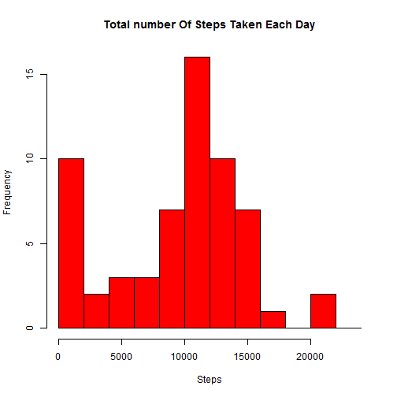

Reproducible Research - Course Project 1
========================================

# Loading and preprocessing the data

The first step is to download the project data from the web and unzipping it.


```r
if (!file.exists("./data")) {
    dir.create("./data")
}
fileUrl <- "https://d396qusza40orc.cloudfront.net/repdata%2Fdata%2Factivity.zip"
download.file(fileUrl, destfile = "./data/projData.zip")
unzip(zipfile = "./data/projData.zip", exdir = "./data")
filePath <- "./data/activity.csv"
```


### 1. Load the data 
To load the data we use the filePath we created above. 


```r
data <- read.csv(filePath, sep = ",", header = TRUE)
str(data)
```

```
## 'data.frame':	17568 obs. of  3 variables:
##  $ steps   : int  NA NA NA NA NA NA NA NA NA NA ...
##  $ date    : Factor w/ 61 levels "2012-10-01","2012-10-02",..: 1 1 1 1 1 1 1 1 1 1 ...
##  $ interval: int  0 5 10 15 20 25 30 35 40 45 ...
```


### 2. Process/transform the data
Then for better analysis, we transform the date column from factor to date type. 


```r
data$date <- as.Date(data$date, "%Y-%m-%d")
head(data)
```

```
##   steps       date interval
## 1    NA 2012-10-01        0
## 2    NA 2012-10-01        5
## 3    NA 2012-10-01       10
## 4    NA 2012-10-01       15
## 5    NA 2012-10-01       20
## 6    NA 2012-10-01       25
```


# What is mean total number of steps taken per day?

In this part of the assignment we ignore the missing values in the dataset. 

### 1. Calculate the total steps per day
For this purpose, I have used aggregate to create the new data frame since it is short and simple.


```r
totalStepsPerDay <- aggregate(data$steps, list(date = data$date), sum, na.rm = TRUE)
colnames(totalStepsPerDay) <- c("date", "totalSteps")
head(totalStepsPerDay)
```

```
##         date totalSteps
## 1 2012-10-01          0
## 2 2012-10-02        126
## 3 2012-10-03      11352
## 4 2012-10-04      12116
## 5 2012-10-05      13294
## 6 2012-10-06      15420
```


### 2. Histogram of the total number of steps taken each day

```r
hist(totalStepsPerDay$totalSteps, breaks = seq(from = 0, to = 25000, by = 2000), 
    col = "red", main = "Total number Of Steps Taken Each Day", xlab = "Steps", 
    ylab = "Frequency")
```

 


### 3. Mean and median of total steps per day
The mean and median of the total number of steps taken per day are calculated below and are as follows:

```r
summary(totalStepsPerDay$totalSteps)["Mean"]
```

```
## Mean 
## 9350
```

```r
summary(totalStepsPerDay$totalSteps)["Median"]
```

```
## Median 
##  10400
```


# What is the average daily activity pattern?

### 1. Average steps per interval
For finding the average steps per interval, I have created a new data frame below and again used aggregate. 

```r
avgStepsPerInterval <- aggregate(x = list(avgSteps = data1$steps), by = list(interval = data1$interval), 
    FUN = mean, na.rm = TRUE)
head(avgStepsPerInterval)
```

```
##   interval avgSteps
## 1        0  1.71698
## 2        5  0.33962
## 3       10  0.13208
## 4       15  0.15094
## 5       20  0.07547
## 6       25  2.09434
```


For plotting this data frame, I have used ggplot2. So at first I include the ggplot2 library package.

```r
library(ggplot2)
```

```
## Warning: package 'ggplot2' was built under R version 2.15.3
```

```r
avgStepsPerIntPlot <- ggplot(avgStepsPerInterval, aes(interval, avgSteps))
avgStepsPerIntPlot <- avgStepsPerIntPlot + geom_line()
print(avgStepsPerIntPlot)
```

 


### 2. The interval with maximum steps
For finding the interval which has the maximum steps, we should first find where it is located in the data frame. By comparing the maximum number of average steps with the *avgSteps* column of *avgStepsPerInterval* we can find the target row. After we have the location of the interval we can show its value.  

```r
maxPosition <- which(avgStepsPerInterval$avgSteps == max(avgStepsPerInterval$avgSteps))
maxInterval <- avgStepsPerInterval[maxPosition, 1]
maxInterval
```

```
## [1] 835
```


# Imputing missing values

### Total number of missing values
For calculating and displaying the number of missing values, I have used table.

```r
table(complete.cases(data))
```

```
## 
## FALSE  TRUE 
##  2304 15264
```


### Filling missing value and creating the imputed dataset
For filling the missing values, I am going to use the impute function. This function needs Hmisc library. This library needs survival library. for this purpose I include both these packages.

```r
library(survival)
```

```
## Warning: package 'survival' was built under R version 2.15.3
```

```
## Loading required package: splines
```

```r
library(Hmisc)
```

```
## Warning: package 'Hmisc' was built under R version 2.15.3
```

```
## Loading required package: grid
## Loading required package: lattice
## Loading required package: Formula
```

```
## Warning: package 'Formula' was built under R version 2.15.3
```

```
## 
## Attaching package: 'Hmisc'
## 
## The following object(s) are masked from 'package:base':
## 
##     format.pval, round.POSIXt, trunc.POSIXt, units
```


After loading the packages, we make use of the impute function. As we can see below, the *imputedData* is a new dataset that is equal to the original dataset but with the missing data filled in. 

```r
imputedData <- data
imputedData$steps <- impute(data$steps, fun = mean)
head(imputedData)
```

```
##   steps       date interval
## 1 37.38 2012-10-01        0
## 2 37.38 2012-10-01        5
## 3 37.38 2012-10-01       10
## 4 37.38 2012-10-01       15
## 5 37.38 2012-10-01       20
## 6 37.38 2012-10-01       25
```


### Histogram of the total number of steps taken each day from the imputed dataset
Now for drawing the histogram of total steps per day from the new imputed dataset, we are going to repeat steps that we did above for the second part of the assignment. But this time we use *imputedData* dataset instead of *data* for creating the histogram.

```r
totalStepsPerDay_imputed <- aggregate(imputedData$steps, list(date = imputedData$date), 
    sum, na.rm = TRUE)
colnames(totalStepsPerDay_imputed) <- c("date", "totalSteps")
hist(totalStepsPerDay_imputed$totalSteps, breaks = seq(from = 0, to = 25000, 
    by = 2000), col = "red", main = "Total number Of (Imputed) Steps Taken Each Day", 
    xlab = "Steps", ylab = "Frequency")
```

 


And again we calculate and report the mean and median total number of steps taken per day. But this time from the new imputed dataset. 

```r
summary(totalStepsPerDay_imputed$totalSteps)["Mean"]
```

```
##  Mean 
## 10800
```

```r
summary(totalStepsPerDay_imputed$totalSteps)["Median"]
```

```
## Median 
##  10800
```


As we can see above, the mean of the new dataset has changed substantially fromt the orignial dataset but the median has stayed roughly the same. So filling in the missing values have had changed the mean a lot. It seems that the results from the imputed dataset are closer to reality since the mean and median show same values.

# Are there differences in activity patterns between weekdays and weekends?

### Creating the weekend-weekday factor ##
As it was mentioned in the assignment, I have made use of the weekdays() function for this part. First I am going to add *day* column to the dataset that shows what day of week is each observation and then I add another column to dataset that says what *dayType* that observation was done. On a weekday or at the weekend. 

```r
imputedData$day <- weekdays(imputedData$date)
weekDays <- c("Monday", "Tuesday", "Wednesday", "Thursday", "Friday")
weekendDays <- c("Saturday", "Sunday")
imputedData$dayType <- ifelse(imputedData$day %in% weekDays, "weekday", "weekend")
head(imputedData)
```

```
##   steps       date interval    day dayType
## 1 37.38 2012-10-01        0 Monday weekday
## 2 37.38 2012-10-01        5 Monday weekday
## 3 37.38 2012-10-01       10 Monday weekday
## 4 37.38 2012-10-01       15 Monday weekday
## 5 37.38 2012-10-01       20 Monday weekday
## 6 37.38 2012-10-01       25 Monday weekday
```


### Average steps averaged across weekday days and weekends days per interval
Below I have created a new dataframe from the new dataset that has *day* and *dayType*. I have called this new dataframe *avgStepsPerInterval2*. I have used aggregate for creating this dataframe. 

```r
avgStepsPerInterval2 <- aggregate(imputedData$steps, by = list(imputedData$dayType, 
    imputedData$day, imputedData$interval), mean)
colnames(avgStepsPerInterval2) <- c("dayType", "day", "interval", "avgSteps")
```


Now that we have the new dataframe with average steps per interval grouped by *dayType*, we can plot it. 

```r
avgStepsPerIntPlot2 <- ggplot(avgStepsPerInterval2, aes(interval, avgSteps))
avgStepsPerIntPlot2 <- avgStepsPerIntPlot2 + geom_line()
avgStepsPerIntPlot2 <- avgStepsPerIntPlot2 + facet_grid(dayType ~ .)
print(avgStepsPerIntPlot2)
```

 

Based on the plot above, we can conclude that weekdays and weekend days have different patterns of activity. Individual have been more active and have recorded more steps during weekdays than weekend days. 
